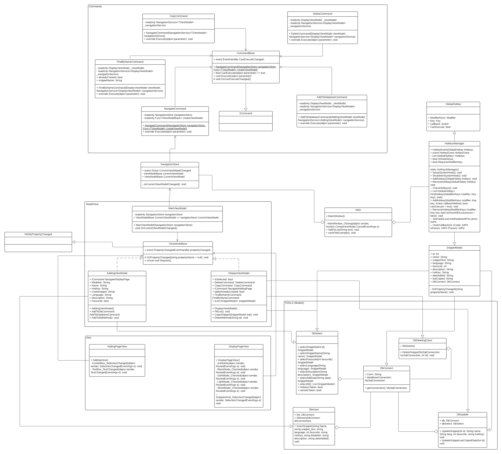
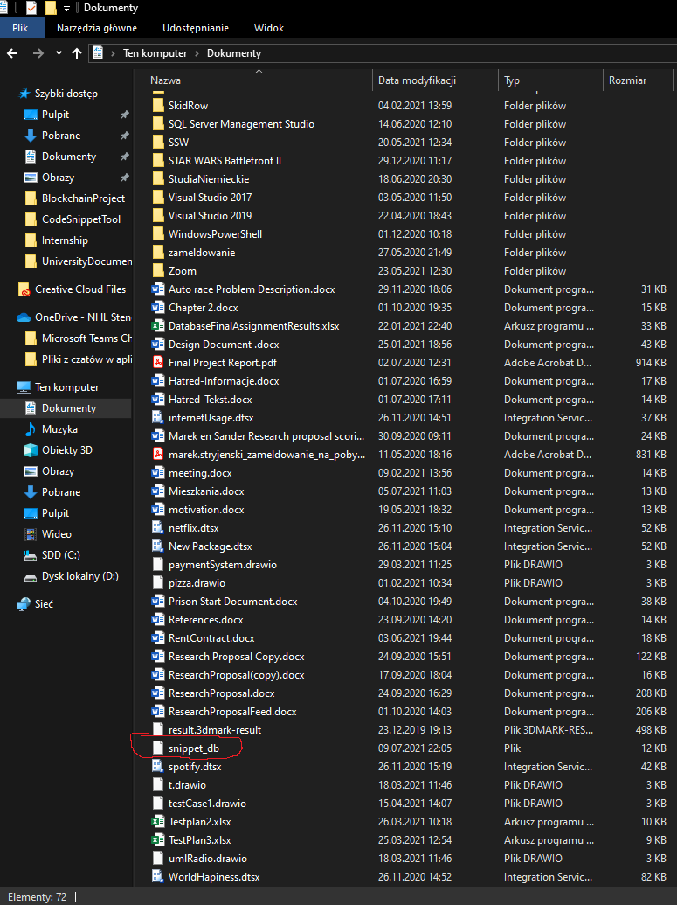

| Name             | Student Nr | Email                                   |
| ---------------- | ---------- | --------------------------------------- |
| Joel Kleibs      | 4666143    | joel.kleibs@student.nhlstenden.com      |
| Marek Stryjenski | 4716779    | marek.stryjenski@student.nhlstenden.com |
| Stefan Pronchev  | 4670876    | stefan.pronchev@student.nhlstenden.com  |
| Ian Donker       | 4629981    | ian.donker@student.nhlstenden.com       |

# CodeSnippetTool

The following document is to provide an overview of all the features and correct usage of the application to maximise the user experience.

## Description

Code Snippet Tool is an WPF application, developed by programmers for programmers. The main purpose of the application is to allow user to save his/her snippets and have an easy access to use them either by using HotKey combination assigned to snippet or by directly coping snippet from the application. The application was developed in MVVM manner using Visual Studio, WPF , .NET Core , MySql, GitHub and Teams Environment.

## Class Diagram

## Basic instructions

### Updates After Discussing project with Jan:
The following section will give an overview of the minimum requirements for the application to run properly
* We followed the advice from Jan and we ended up using SQL-lite for our application. There fore when you start the application the file called snippet_db is created in your documents folder. If you delete this file and start the application again this file will be created again.
* We also fixed so called pyramids of doom ( if statements inside if statements. Make methods instead for those if statements)
* We tried implementing instant paste in when using hot-key or copy command but we run into some problems. Because we simulate the pressing of the keys, our method that checks if the key has been pressed (HotKeysManager.HookCallback) is being executed. This causes run time errors, and text is never pasted in because of that. I tried using async/await and Task<> but I was keep getting the same error that IKeyboardSimulator does not contain definition for GetAwaiter. There was a simple temporary solution by implementing Thread.Sleep(1000) but we decided this is not a right solution and we just sticked with windows notifications when u copy the snippet.
* The hot-key is working. If you assigned the hot-key to snippet and press it you will get the snippet. If you press preview snippet checkbox every time you press hot-key you will get message box notification

### How to use:

* On the applications adding page, it will be possible to add code snippets to the database. A snippet name, description, and the snippet itself are required. 
	Optionally the user may enter if the snippet is a favourite by ticking the checkbox and add a hot key binding. The binding requires a key and a modifier! Note that the program is coded so that if the hotkey is taken, the snippet will be added regardless, without the entered hotkey binding.
* On the display page is a table with all snippets. To modify one simply select a row, make the changes and then unselect the row OR select a different row for these changes to be applied.
* When updating a hotkey command, the refresh button has to be pressed to apply the hotkey command changes.  Make sure also that Preview Snippet is checked if you wish to view snippet
* A snippet can be copied via the copy button or a hotkey combination.
* The show snippet preview checkbox will allow a user to check what they have copied if they wish, and disable notifications when copying from the application when working on something else. 
* A user can simply sort the table by clicking on table headers. 
* The searching for snippets works by entering a name into the name field without a snippet selected and pressing the find button.
* After coping snippet the copy date is updated in database. To view it in application simply press refresh button
